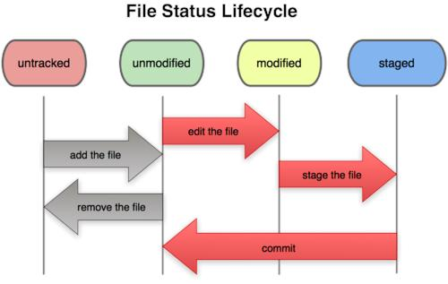

# 初识操作系统实验报告

学号：19231188

姓名：李健健

## 实验思考题

### 思考题0.1

**通过你的使用经验，简单分析 CLI Shell，GUI Shell 在你使用过程中的各自优劣（100 字以内）**

上手的难易程度：CLI学习成本较高，GUI简单直观。

功能的广度：CLI适用于写代码，以及完成一些规模较小的小工程，而GUI几乎万能——coding、绘画、工业制图，都有相应的GUI。

灵活性：CLI更加灵活。比如批量重命名文件，可以写脚本。

调用系统资源：CLI更胜一筹

### 思考题 0.2

**使用你知道的方法（包括重定向）创建下图内容的文件（文件命名为test），将创建该文件的命令序列保存在command文件中，并将test文件作为批处理文件运行，将运行结果输出至result文件中。给出command文件和result文件的内容，并对最后的结果进行解释说明（可以从test文件的内容入手）**

**具体实现的过程中思考下列问题：**

**echo Shell Start 与 echo 'Shell Start'效果是否有区别**

**echo \$c>file1 与 echo '\$c>file1' 效果是否有区别**

#### command和result

可以使用vim创建文件，command文件中内容如下（[key]表示按下键盘上对应的按键）：

```
vim command [enter]
i
echo Shell Start ...
echo set a = 1
a=1
echo set b = 2
b=2
echo set c = a+b
c=$[$a+$b]
echo c = $c
echo save c to ./file1
echo $c>file1
echo save b to ./file2
echo $b>file2
echo save a to ./file3
echo $a>file3
echo save file1 file2 file2 to file4
cat file1>file4
cat file2>>file4
cat file3>>file4
echo save file4 to ./result
cat file4>>result
[esc]
:wq
[enter]
```

result文件中的内容为

```
3
2
1
```

#### 解释说明

`echo sth`，将`sth`输出至主屏幕

`echo sth > out`，将`sth`输出至`out`文件

`a=1`，表示新建变量并赋值为1

`c=$[$a+$b]`，表示新建变量`c`，赋值为`a+b`

`cat file`，表示将file的内容输出到屏幕上

`cat file>out`，表示将`file`的内容输出到`out`文件中，`out`将被`file`中内容覆盖

`cat file>>out`，表示将`file`中的内容追加到`out`文件中

#### 问题思考

`echo Shell Start`和`echo 'Shell Start'`在效果上无区别

`echo \$c>file1`表示将变量c输出到file1中

`echo '\$c>file1'`直接将`''`中的内容输出到屏幕上，即，使用单引号，不转义

### 思考题 0.3

**仔细看看这张图，思考一下箭头中的 add the file 、stage the file 和commit 分别对应的是 Git 里的哪些命令呢？**



`add the file`对应 `git add <filename>`

`stage the file`对应 `git add <filename>`

`commit the file` 对应 `git commit <filename>`

### 思考题0.4

**深夜，小明在做操作系统实验。困意一阵阵袭来，小明睡倒在了键盘上。等到小明早上醒来的时候，他惊恐地发现，他把一个重要的代码文件printf.c删除掉了。苦恼的小明向你求助，你该怎样帮他把代码文件恢复呢？**

**正在小明苦恼的时候，小红主动请缨帮小明解决问题。小红很爽快地在键盘上敲下了git rm printf.c，这下事情更复杂了，现在你又该如何处理才能弥补小红的过错呢？**

**处理完代码文件，你正打算去找小明说他的文件已经恢复了，但突然发现小明的仓库里有一个叫Tucao.txt，你好奇地打开一看，发现是吐槽操作系统实验的，且该文件已经被添加到暂存区了，面对这样的情况，你该如何设置才能使Tucao.txt在不从工作区删除的情况下不会被git commit指令提交到版本库？**

`git checkout -- printf.c`

`git checkout -- printf.c`

`git rm --cached Tucao.txt`

### 思考题0.5

**思考下面四个描述，你觉得哪些正确，哪些错误，请给出你参考的资料或实验证据。**

1. 克隆时所有分支均被克隆，但只有HEAD指向的分支被检出。
2. 克隆出的工作区中执行 git log、git status、git checkout、git commit等操作不会去访问远程版本库。
3. 克隆时只有远程版本库HEAD指向的分支被克隆。
4. 克隆后工作区的默认分支处于master分支。

[参考资料](https://blog.csdn.net/weixin_45086881/article/details/90610606)。

1. 正确

克隆`GitHub`用户`refkxh`的`BUAA_OS_2020Spring`仓库，使用`git branch -a`命令查看，可以看到所有分支。

在断网的情况下，使用`git checkout branch_name`命令，可以切换到已有的分支，说明，所有分支在联网`clone`时，全部被保存到了本地。

但是在`clone`到本地时，本地文件夹会显示**也只能显示**一个`branch`的信息，这个就是当前`HEAD`所指向的`branch`，像我举的这个例子，就是指向的分支就是`lab6`。

2. 正确

在我们做作业时要提交到远程，`git commit`是不够的，还需要git push，push提交后，生成的log文件在远程仓库，我们本地还是看不到，git log、git statu也找不到远程的关于log的记录，需要git pull访问远程仓库。

3. 错误

和问题1矛盾。

4. 错误

分支名字只是个代号。问题1中，clone下来后，分支是lab6。

## 实验难点图示

1. 实验很难
2. 用图来表示实验哪些地方难，这个行为也很难。

## 体会与感想

难度评价，中等。

花费时间：两天左右。

### 自己和大佬对比下的弱小

上机的时候，进行一次push就可以离开。后来在水群的时候，看到有同学在讨论一道题目，ta描述了自己上机那天的做法。这说明，那天，除了有像我这种，匆匆push后就离场的人（实在是太菜），还有做了好几道题的人。不由得感叹，这就是差距啊。

### 对CLI的陌生和新奇

我其实不是第一次使用Linux，macOS也是类Unix系统，但是平时不开terminal。terminal功能强大，但是要背命令，这一点，对于记忆力不好的我来说，比较吃力。

用的最多的命令是`ls`，😄 。

看到很多命令，感觉很新奇，但是，又有一种陌生且害怕的感觉。

## 指导书反馈

姑且把指导书理解为我能在cscore上看到的所有材料，然后提一点微不足道的建议。

1. 指导材料太多，没时间全部看完。
2. 思考题可以像计组那样，每个lab/project汇总到一起麻，比如一个章节的学习内容结束后，单开一页汇总下前面的思考题，否则一个个翻挺累的。
3. 我觉得可以提供一些讲得通俗易懂的材料，比如我在B站看到一个讲Makefile的[视频](https://www.bilibili.com/video/BV1Mx411m7fm)，我觉得不错。到时候，可以汇总下这些互联网的优秀资源，和指导书相结合。
4. 放假时候，可以开cscore，教一点简单的东西。
