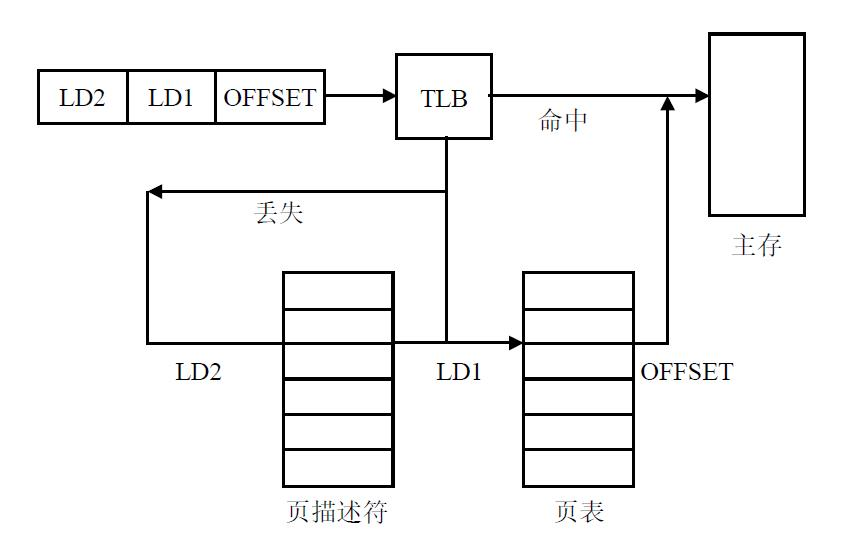

# 笔记

## TLB

当一个虚拟地址被送到MMU中进行翻译的时候，硬件首先在TLB中寻找包含这个地址的页面，如果它的虚页号在TLB中，并且没有违反保护位，那么就可以直接从TLB中得到相应的物理页号，而不去访问页表；如果发现虚页号在TLB中不存在，那么MMU将进行常规的页表查找，同时通过一定的策略来将这一页的页表项替换到TLB中，之后再次访问这一页的时候就可以直接在TLB中找到

## TLB/MMU/Cache

MMU含两级页表，任何一个虚拟地址都能经过MMU转换成物理地址，不过这样需要两步访存。TLB叫做“快表”，直接存储某些virtual address到physical address的映射，如果一个虚拟地址可以经过TLB转换成物理地址，那么就不要经过MMU了。

拿到了物理地址后，可以直接访问内存拿数据，不过会慢，所以，Cache就是部分物理地址到数据的映射。是内存的一部分copy。
